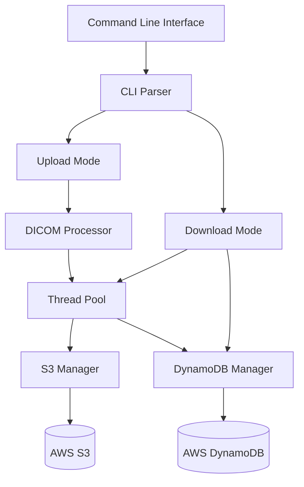

# DICOM Transfer Utility - Architecture Documentation

## System Architecture

## Component Details

### 1. Command Line Interface (CLI)
- Entry point for the application
- Handles command-line arguments and flags
- Supports upload and download modes
- Configurable parameters: thread count, verbosity, AWS region

### 2. DICOM Processor
- Validates DICOM files
- Extracts metadata and study UIDs
- Groups files by study
- Generates JSON metadata

### 3. Thread Pool
- Manages concurrent file transfers
- Implements worker threads for parallel processing
- Handles task scheduling and execution
- Provides synchronization mechanisms

### 4. S3 Manager
- Handles file uploads/downloads to/from AWS S3
- Implements retry mechanisms
- Manages encryption and secure transfers
- Validates file integrity

### 5. DynamoDB Manager
- Stores and retrieves study metadata
- Manages file location tracking
- Handles table creation and validation
- Implements error handling for database operations

## Data Flow

### Upload Flow
1. User provides directory containing DICOM files
2. DICOM Processor validates and groups files by study
3. Thread Pool initiates parallel uploads
4. S3 Manager transfers files to cloud storage
5. DynamoDB Manager stores metadata and file locations

### Download Flow
1. User provides Study UID
2. DynamoDB Manager retrieves file locations
3. Thread Pool manages parallel downloads
4. S3 Manager retrieves files from cloud storage
5. Files are saved to specified local directory

## Security Considerations

1. **Data in Transit**
   - TLS encryption for all AWS communications
   - Secure file transfer protocols

2. **Data at Rest**
   - Server-side encryption for S3 objects
   - Encrypted DynamoDB tables

3. **Authentication**
   - AWS IAM roles and policies
   - Credential management 